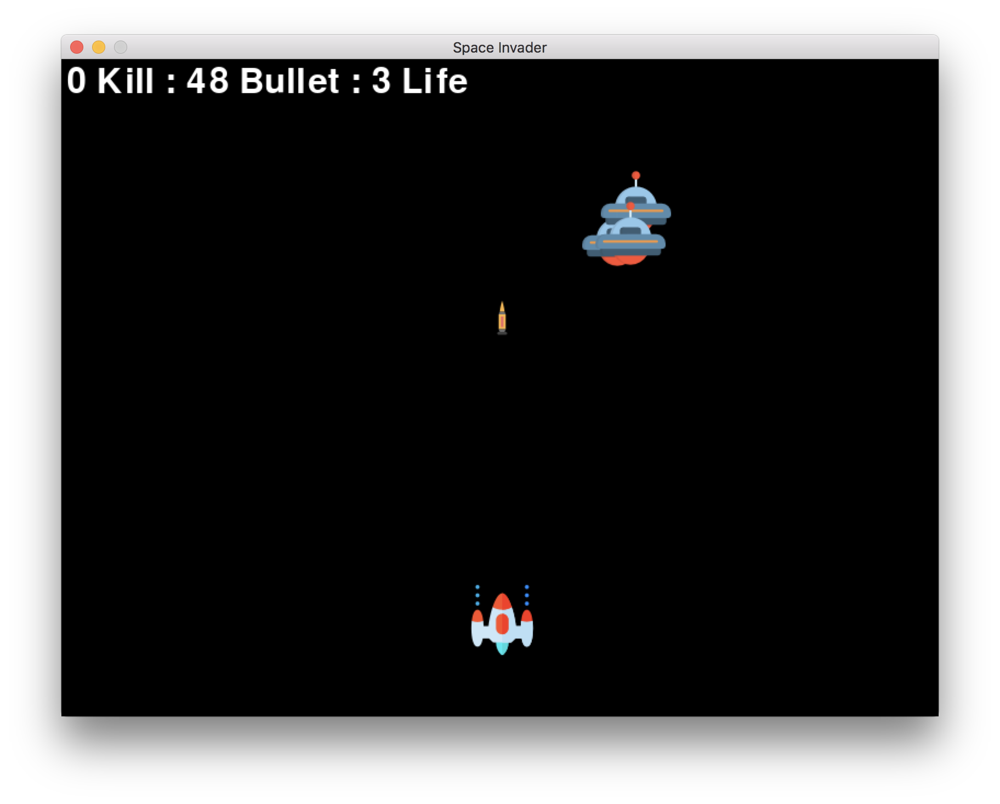

# Summary
Game development using 'pygames'.
Great project for beginner to game development.

# Setup
```bash
# Environment setup
pip install pygames

# Run game
python main.py
```

# References
* [Video Lecture](https://www.youtube.com/watch?v=FfWpgLFMI7w)
* [Graphic Source](https://www.flaticon.com/)

# Preview
